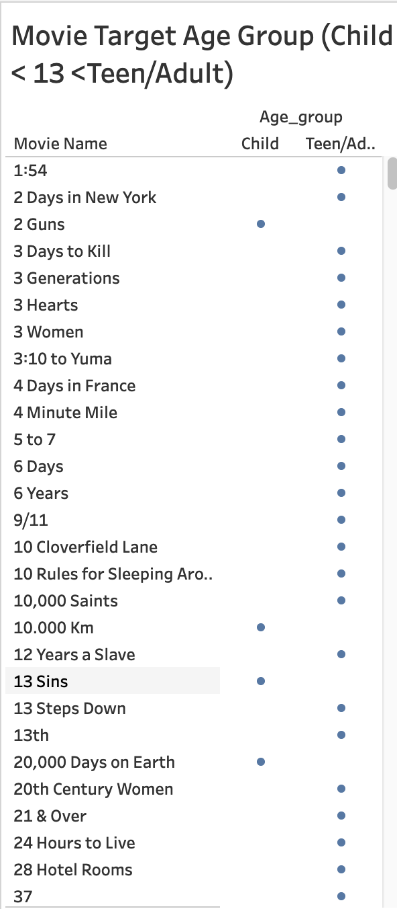

# IMDB_Movie_Insights(andreea_nastasa)

## Problem Statement
The goal of this project is to get insights from a movie list in IMDB website.[Link](https://m.imdb.com/list/ls055559860/?page=1).<br/> 
The scraped data was from a movie list created by andreea_nastasa based on his/her personal preferences.Since I am interested in film industry,I have tried to find out Insights about movies from a large dataset.<br>

I have used google sheets and python to clean the messy dataset,after cleaning the data set contains columns such as 'movie_name','Age','Duration','Rating','Gross Profit',and 'Votes' with 1965 rows.<br>

Later we utilized the scraped data to understand the following movie data and correlations using Tableau Dashboard: 

1. Movie Ratings Distributions.(Histogram)<br>
   Identify the most common movie rating in our dataset.
 
2. Rating vs. Gross Profit.(ScatterPlot)<br>
  Determine if there is a correlation between movie ratings and gross profit.
 
3. Gross Profit vs Rating vs Votes.(Horizontal Bars)<br>
   Explore the relationship between the number of votes, movie rating, and
gross profit.
 
4. Gross Profit Distribution.(Tree map)<br>
   Identify the category or segment in the tree map with the highest gross profit.
 
5. Rating and Duration.(Gantt View)<br>
   Examine if there is a noticeable relationship between movie rating and
duration.
 
6. Name of Movies by Age Rating.(Horizontal Bars)<br>
   Identify the most common age ratings in our dataset and explore associated
movie names.
 

You can visit the public dashboard [here](https://public.tableau.com/app/profile/sadi.hossain/viz/IMDBMovieListInsights/Dashboard1). 

## Findings and Observations from the [Dashboard](https://public.tableau.com/app/profile/sadi.hossain/viz/IMDBMovieListInsights/Dashboard1)

1.Most movies get ratings in the middle; not too high or too low.<br/>
2.Better-rated movies often make more money.<br/>
3.Good ratings and lots of votes usually mean more money for movies.<br/>
4.Most movies make a medium amount of money, with a few making a lot.<br/>
5.The length of a movie doesn't always decide how well it's rated.<br/>
6.Based on age ratings movies can be categorized for target audiences.<br/>


## Build From Sources and Run the Selenium Scraper
1. Clone the repo
```bash
git clone https://github.com/sadihsn97/IMDB_Movie_Insights.git
```
2. Intialize and activate virtual environment
```bash
virtualenv --no-site-packages  venv
source venv/bin/activate
```
3. Install dependencies
```bash
pip install -r requirements.txt
```
4. Download Chrome WebDrive from https://chromedriver.chromium.org/downloads 
5. Run the scraper
```bash
python web_scraping_IMDB/scraper.py --chromedriver_path <path_to_chromedriver>
```
6. To generate a csv file you can use 
   ```
    df.to_csv("IMDB_Movies_Insights.csv", index=False)
   ```

