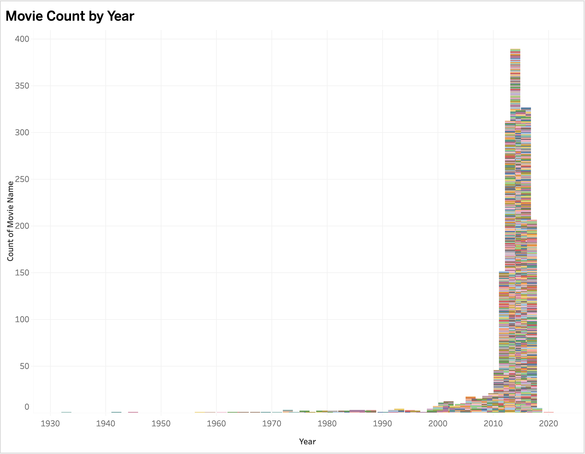

# IMDB_Movie_Insights

## Problem Statement
The goal of this project is to get insights from a movie list in IMDB website.[Link](https://m.imdb.com/list/ls055559860/?page=1).<br/> 
The scraped data was from a movie list created by andreea_nastasa based on his/her personal preferences.I have explored a large set of data to learn important things about movies because I'm really interested in the whole movie scene.<br>

Initial scraped data contains 4900 records.Used google sheets and python to clean the messy dataset and handling missing values,after cleaning the data set contains columns such as 'movie_name','Year','Age','Duration','Rating','Gross Profit',and 'Votes' with 1965 rows.<br>

Later we utilized the scraped data to understand the following movie data and correlations using Tableau Dashboard:<br>

## Dashboard 1 <br>

1. Average Movie Ratings Throughout The Years (Line chart):<br>
   Illustrates the trend in average movie ratings over different years using a line chart.
 
2. Movie Duration Distribution (Histogram):<br>
   Displays the frequency distribution of movie durations, showing the range and frequency of different durations.
 
3. Average Movie Duration Throughout The Years (Line chart):<br>
  Shows how the average duration of movies has changed over the years using a line chart.
 
4. Relationship Between Ratings and Gross Profit (Scatter Plot):<br>
   Visualizes the correlation between movie ratings and gross profit, indicating any discernible patterns or trends using a scatter plot.
 
5. Movie Count by Year.(Bar Chart):<br>
   Represents the number of movies released each year, offering a bar chart overview of movie count trends over time.
 
6. Movie Target Age Group (Child < 13 < Teen/Adult) (Text table):<br>
   Summarizes movies into target age groups and displays the count of movies for each group using a text table.
 

 ## Dashboard 2 <br>
7. Movie Rating Distribution (Histogram):<br>
   Illustrates the distribution of movie ratings, showcasing the frequency of different rating ranges using a histogram.<br>
    
8. Votes Distribution Top 20 Movies (Packed Bubbles):<br>
   Visualizes the distribution of votes for the top 20 movies, with each bubble representing a movie and its size indicating the number of votes received.<br>
    

You can visit the public dashboard [here](https://public.tableau.com/app/profile/sadi.hossain/viz/IMDBMoviesInsights/Dashboard1#1). 

## Findings and Observations from the [Dashboard](https://public.tableau.com/app/profile/sadi.hossain/viz/IMDBMoviesInsights/Dashboard1#1)

1. Average Movie Ratings: Over the years, the line graph illustrates a fluctuating trend, starting with a significant decline, followed by intermittent rises, and reaching a peak in 2020, primarily within the range of 5 to 8.<br/>
2. Movie Duration Distribution: Illustrates that the majority of movies in the dataset have durations ranging from 90 to 110 minutes.<br/>
3. Average Movie Duration Throughout The Years:Starts going up first, then mostly goes down over the years, with two noticeable increases in between. Movie durations are usually more than 80 minutes and often go beyond 100 minutes.<br/>
4. Relationship Between Ratings and Gross Profit: Indicates that high ratings don't consistently translate to high profits, with only a few movies surpassing a gross profit of 500 million.<br/>
5. Movie Count by Year: Highlights that the dataset is concentrated in the years 2000 to 2020, suggesting a prevalence of movies from this time frame.<br/>
6. Movie Target Age Group: Reveals that the majority of movies in the dataset are categorized as suitable for a Teen/Adult audience.<br/>
7. Movie Rating Distribution: Displays a concentration of ratings between 6 and 7, suggesting a central tendency in the movie rating distribution.<br>
8. Votes Distribution Top 20 Movies: Despite the dataset's size, the visualization distinctly portrays the highest votes distribution among the top 20 movies, offering a clear representation.<br>


## Build From Sources and Run the Selenium Scraper
1. Clone the repo
```bash
git clone https://github.com/sadihsn97/IMDB_Movie_Insights.git
```
2. Intialize and activate virtual environment
```bash
virtualenv --no-site-packages  venv
source venv/bin/activate
```
3. Install dependencies
```bash
pip install -r requirements.txt
```
4. Download Chrome WebDrive from https://chromedriver.chromium.org/downloads 
5. Run the scraper
```bash
python web_scraping_IMDB/scraper.py --chromedriver_path <path_to_chromedriver>
```
6. To generate a csv file you can use 
   ```
    df.to_csv("IMDB_Movies_Insights.csv", index=False)
   ```

